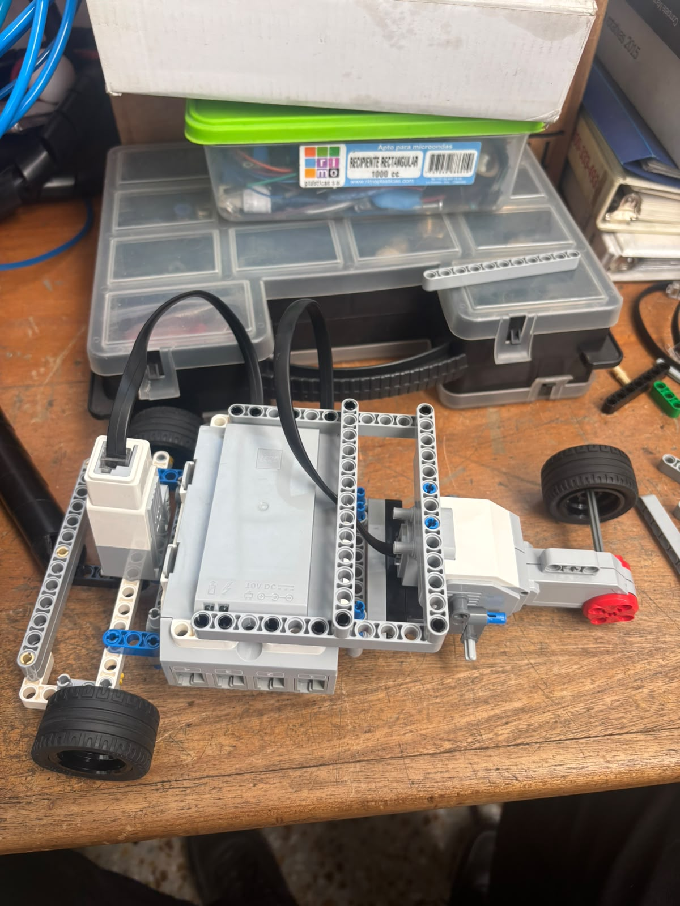
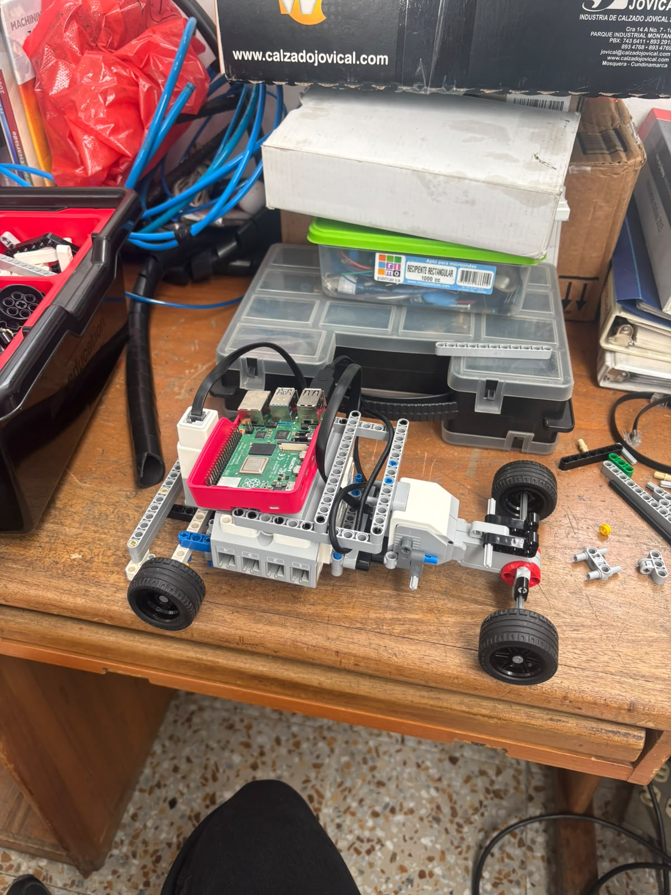
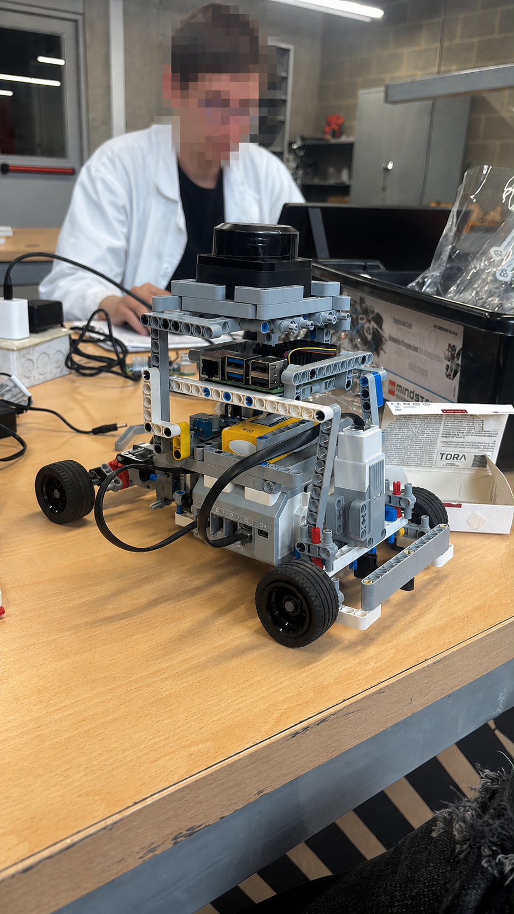
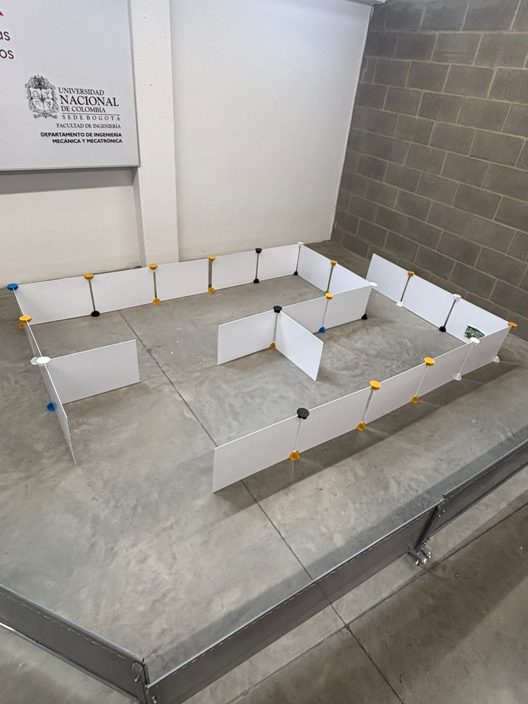
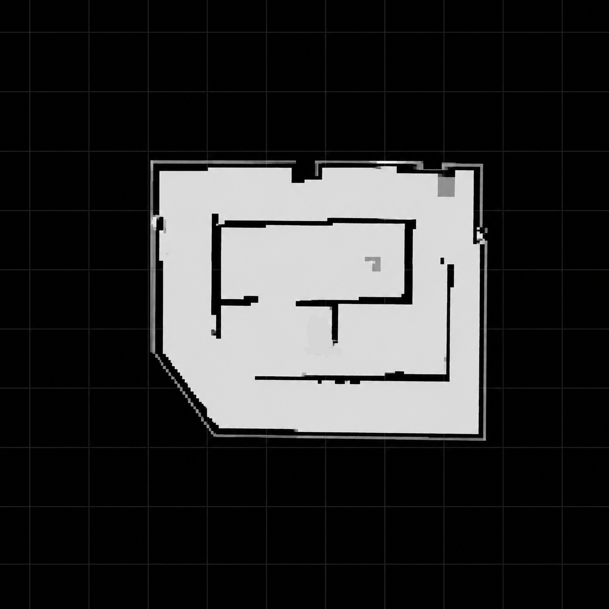
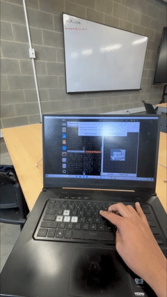

# Vehículo con Dirección Ackermann para Implementación de SLAM
## Descripción

Este proyecto presenta el desarrollo e implementación de un vehículo con dirección **Ackermann** utilizando **ROS 2 Jazzy**. El objetivo principal es desarrollar una plataforma de robótica móvil capaz de implementar algoritmos de **Simultaneous Localization and Mapping (SLAM)** y realizar navegación autónoma en un entorno controlado.

La arquitectura del sistema se divide en tres componentes principales: **control**, **percepción** y **navegación**.

### Control del vehículo

El control del movimiento está a cargo de un **LEGO EV3**, el cual se comunica con una **Raspberry Pi 5** mediante una conexión **socket TCP/IP**. La Raspberry Pi ejecuta ROS 2 y actúa como puente entre el hardware y el ecosistema ROS.

Para integrar el vehículo con ROS 2 se implementó un sistema basado en **ros2_control**, utilizando el controlador **bicycle_steering_controller**, adecuado para plataformas con dirección Ackermann. Esta integración requirió el desarrollo de:

- Un servidor que se ejecuta en el LEGO EV3.
- Un driver encargado de la comunicación entre el EV3 y la Raspberry Pi.
- Una **Hardware Interface** personalizada para conectar el hardware físico con `ros2_control`.

Gracias a esta arquitectura es posible controlar el robot desde ROS 2 de forma transparente y publicar la información de odometría necesaria para el resto del sistema.

### Percepción y estimación del estado

La percepción del entorno se realiza mediante un **LiDAR**, utilizado para la adquisición de información del entorno y la generación de mapas.

Uno de los principales desafíos en plataformas móviles es la presencia de ruido en los sensores y errores mecánicos, como el deslizamiento de las ruedas, los cuales afectan significativamente la estimación de la posición del robot. Para reducir estos errores se implementó un filtro de Kalman utilizando el paquete **robot_localization**.

El filtro fusiona información proveniente de tres fuentes:

- Odometría de las ruedas.
- Unidad de Medición Inercial (IMU).
- Odometría obtenida mediante LiDAR.

La fusión de estos sensores permite obtener una estimación de la pose considerablemente más precisa y robusta que utilizando cada sensor de forma independiente.

### Mapeo, localización y navegación

Una vez obtenida una estimación confiable de la odometría, se implementó el proceso de mapeo utilizando **slam_toolbox**, permitiendo construir un mapa del entorno de manera simultánea mientras el robot estima su posición.

Posteriormente, se empleó el algoritmo **Adaptive Monte Carlo Localization (AMCL)** para realizar la localización del robot sobre el mapa previamente generado.

Finalmente, se integró el sistema con la pila de navegación de ROS 2 (**Nav2**), realizando el ajuste y optimización de los diferentes parámetros de planificación, control y recuperación hasta obtener un comportamiento estable durante la navegación autónoma dentro del entorno de pruebas.

---

## Objetivos

- Implementar un modelo cinemático Ackermann en ROS 2.
- Integrar el robot con `ros2_control`.
- Adquirir datos de sensores para tareas de percepción.
- Implementar algoritmos de SLAM.
- Visualizar el robot y el mapa generado mediante RViz.
- Servir como plataforma para futuros desarrollos en navegación autónoma.

---

## Características

- 🚗 Modelo cinemático Ackermann.
- 🤖 Descripción del robot mediante URDF/Xacro.
- ⚙️ Integración con `ros2_control`.
- 📡 Compatibilidad con sensores LiDAR.
- 🗺️ Implementación de SLAM.
- 📍 Publicación de odometría y transformaciones (`tf`).
- 🖥️ Visualización en RViz.
- 📦 Organización modular mediante paquetes ROS 2.

---

## Estructura del Proyecto

```
├── src/
│   ├── mi_ackermann_description/
│   │   ├── urdf/
│   │   ├── meshes/
│   │   ├── config/
│   │   └── launch/
│   │
│   ├── mi_ackermann_hardware/
│   │   ├── src/
│   │   ├── include/
│   │   └── config/
│   │
│   ├── mi_ackermann_bringup/
│   │   ├── launch/
│   │   ├── config/
│   │   └── rviz/
│   │
│   └── ...
│
└── README.md
```

---

## Requisitos

- Ubuntu 24.04 LTS
- ROS 2 Jazzy
- colcon
- rosdep

Paquetes principales:

- robot_state_publisher
- joint_state_publisher
- xacro
- ros2_control
- ros2_controllers
- controller_manager
- rviz2
- tf2_ros
- slam_toolbox (o cualquier implementación de SLAM compatible)

## Ejecución

Lanzar el sistema:

```bash
ros2 launch mi_ackermann_bringup carlike.launch.xml
```

Visualizar en RViz:

```bash
rviz2
```

---

## Diagrama General

```
                    +-------------------+
                    |      LiDAR        |
                    +---------+---------+
                              |
                              v
+-------------+       +--------------------+
| ros2_control| ----> | Robot Ackermann    |
+-------------+       +--------------------+
                              |
                              v
                      Publicación de TF
                              |
                              v
                        Odometría (/odom)
                              |
                              v
                      Algoritmo de SLAM
                              |
                              v
                        Mapa (/map)
                              |
                              v
                            RViz
```

---

## Tecnologías Utilizadas


- LegoEV3
- ROS 2 Jazzy
- C++
- Python        
- URDF/Xacro
- ros2_control
- RViz2
- TF2
- LiDAR
- SLAM Toolbox

---

## Implementando la direccion ackermann

Para implementar la dirección Ackermann se utilizaron piezas de LEGO EV3 para construir el mecanismo de dirección. Es importante resaltar que existen diferentes configuraciones para implementar este tipo de mecanismo; sin embargo, se optó por la mostrada en la Figura 1 debido a que permite obtener una retroalimentación directa y precisa del ángulo de giro. En otras configuraciones, como el mecanismo de cremallera y piñón, es necesario considerar un factor de escala para relacionar el desplazamiento del actuador con el ángulo de dirección, lo que añade complejidad al sistema de control.

<p align="center">
  
</p>


Uno de los principales desafíos durante el diseño fue garantizar la rigidez y estabilidad del chasis. Las primeras versiones del vehículo funcionaban correctamente cuando se evaluaban de forma aislada; sin embargo, se evidenció que la estructura no soportaría adecuadamente el peso de los demás componentes del sistema, como la batería, la Raspberry Pi, el LiDAR y los demás elementos electrónicos. Por esta razón, el diseño del chasis fue reforzado hasta obtener una estructura suficientemente resistente para soportar la carga del robot sin comprometer su funcionamiento.

<p align="center">
  
</p>

## Implementando ros2_controller

Una vez implementado el chasis del vehículo, el siguiente paso consistió en establecer un puente de comunicación entre el LEGO EV3 y ROS 2. Para ello se empleó la infraestructura proporcionada por **ros2_control**, la cual facilita la integración de hardware con el ecosistema de ROS 2.

Antes de configurar **ros2_control**, fue necesario definir el mecanismo de comunicación entre la Raspberry Pi 5 y el LEGO EV3. En este proyecto se optó por una conexión a través de una red local utilizando un socket TCP/IP bajo una arquitectura cliente-servidor. En esta arquitectura, el LEGO EV3 ejecuta un servidor encargado de recibir los comandos de velocidad enviados desde la Raspberry Pi y aplicarlos directamente a los motores.

Por otra parte, en la Raspberry Pi se desarrolló un *driver* en C++ que actúa como cliente del servidor. Además de gestionar la comunicación, este *driver* realiza las conversiones necesarias entre las unidades utilizadas por ROS 2 y las empleadas por el EV3. En particular, convierte las velocidades angulares expresadas en rad/s al porcentaje de potencia requerido por los motores del EV3 y transforma las lecturas de los encoders en las unidades utilizadas por el controlador.

Con la comunicación establecida, se implementó la interfaz de hardware (*Hardware Interface*) de **ros2_control**, la cual constituye el puente entre el hardware físico y los controladores de ROS 2. Esta interfaz define las variables de estado (*State Interfaces*) que serán leídas desde el robot, las variables de comando (*Command Interfaces*) que recibirán los controladores y el ciclo de vida del hardware, incluyendo los estados de configuración, activación, desactivación y apagado. La correcta definición de esta interfaz resulta fundamental, ya que permite que ROS 2 interactúe de forma transparente con el LEGO EV3.

Finalmente, se configuró el controlador encargado de la locomoción del vehículo. La biblioteca **ros2_controllers** ofrece diferentes controladores para plataformas móviles; sin embargo, debido a que el robot posee una configuración tipo Ackermann, se optó por utilizar el **bicycle_steering_controller**. Este controlador implementa un modelo cinemático simplificado de un vehículo tipo automóvil (*car-like*), el cual resulta adecuado para este proyecto y permite controlar el movimiento del robot mediante comandos de velocidad lineal y velocidad angular. En el siguiente video se presenta la ejecución del vehículo utilizando este controlador.


<p align="center">
  
</p>

[📹 Descargar o ver el video](video/ev3_ros2.mp4)

## Implementacion SLAM

Teniendo nuestro control de movimiento implementado, era momento de trabajar en la percepción del vehículo, ya que, para poder navegar, es necesario tener conocimiento de nuestro entorno. Para ello, se planteó utilizar un LiDAR, que no solo nos permite obtener los datos necesarios para el mapeo, sino que, además, a partir de estos datos, podemos obtener la odometría del LiDAR. Posteriormente, esta fue fusionada con los datos de los encoders de las ruedas y los datos de una IMU, ya que la odometría es una fuente de información que puede presentar bastante ruido.

Teniendo esto en cuenta, al final de todo el proceso, el robot quedó de la siguiente forma:

<p align="center">
  
</p>

Teniendo el hardware conectado correctamente y funcionando, fue momento de implementar los paquetes del LiDAR para obtener la odometría, así como el paquete robot_localization para realizar el filtro de Kalman con las diferentes fuentes de información. Además, se configuró el archivo necesario para comenzar con el mapeo del siguiente escenario:

<p align="center">
  
</p>

Teniendo las baterías cargadas y todos los paquetes inicializados, se comenzó a realizar el mapeo para obtener el siguiente mapa. Es necesario resaltar que se realizó un posprocesamiento de los datos obtenidos para mejorar la calidad del mapa.

<p align="center">
  
</p>

El proceso de mapeo se presenta en el siguiente video:

<p align="center">
  
</p>

[📹 Descargar o ver el video](video/Mapping.mp4)


## Autor

**Jeison Nicolás Díaz Arciniegas**

Universidad Nacional de Colombia

Ingeniería Mecatrónica
